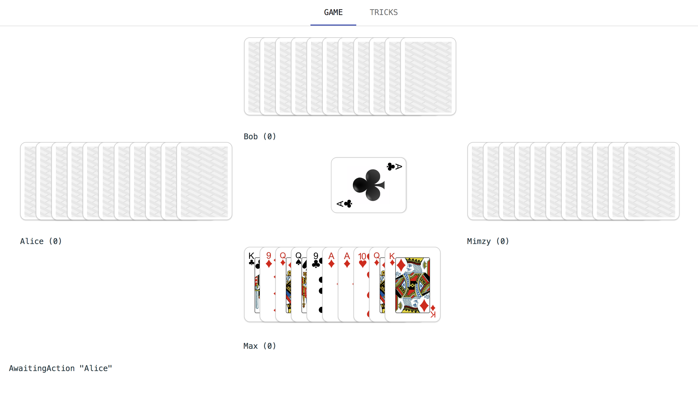

# Doubleheader

A multiplayer web version of the popular German card game "Doppelkopf".

It's implemented as an [Elm](http://elm-lang.org/) frontend and
[Elixir](https://elixir-lang.org/) backend with communication over web sockets.

Currently, a normal game (when all players are "healthy") is playable, but the
other game types are still a work in progress.



## Running it

The repo includes a `docker-compose.yml` to serve the frontend and backend:

```bash
docker-compose up
```

Now the application should be accessible at http://localhost:3000.
